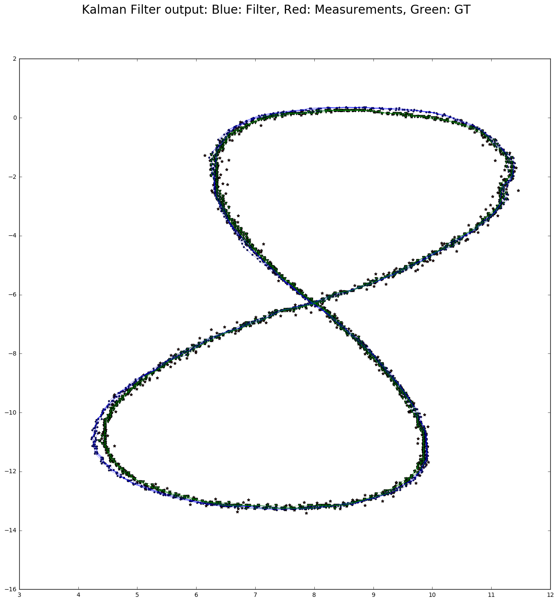
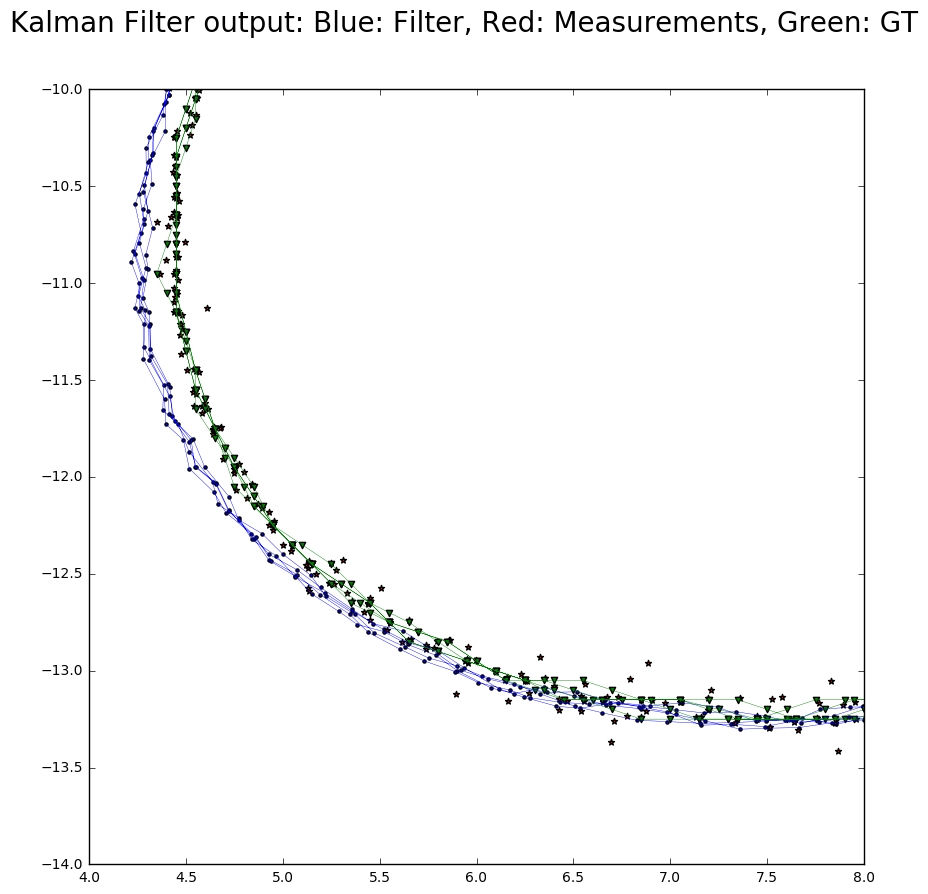
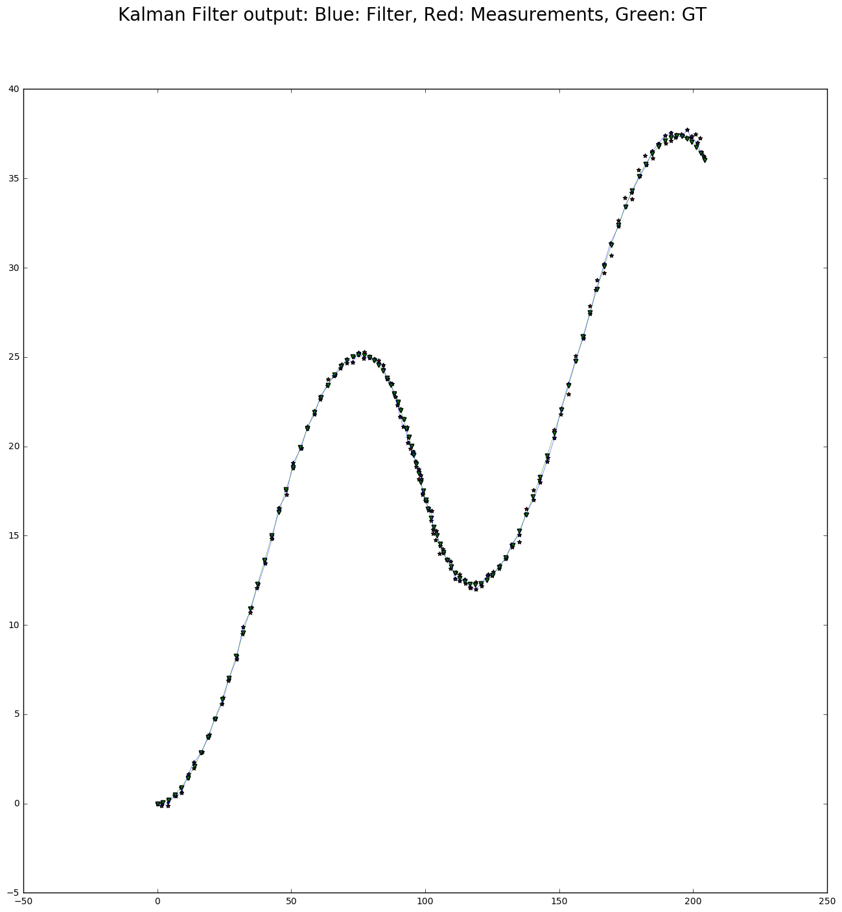

# Extended Kalman Filter Project

Build the project from the build directory
```
$cmake..&& make
```
Run the kalman Filter from the build directory
```
./ExtendedKF ../data/sample-laser-radar-measurement-data-2.txt ../results/dataset1.txt
```


## Dataset 1

RMSE from sample-laser-radar-measurement-data-1:

Accuracy - RMSE:
- x: 0.0651649
- y: 0.0605378
- vx: 0.54319
- vy: 0.544191




## Dataset 2

RMSE from sample-laser-radar-measurement-data-2:

Accuracy - RMSE:
- x: 0.185496
- y: 0.190302
- vx: 0.476754
- vy: 0.804469


